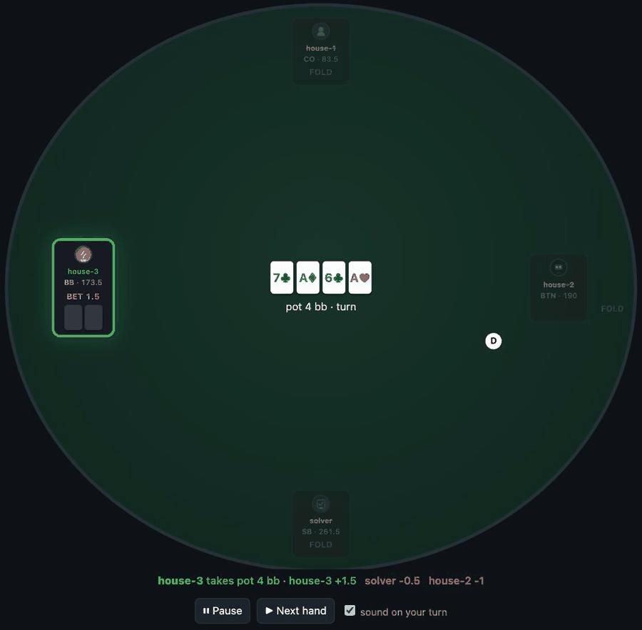

<div align="center">

# pokerarena

**A poker table you can actually sit at — with friends in a browser, with bots in process, or both at once.**

<p><a href="https://frla18cz.github.io/poker-arena/">Docs</a> · <a href="#playing-with-other-people">Play with friends</a> · <a href="#solver-seats">Solver seats</a> · <a href="https://github.com/frla18cz/poker-solver">The maths behind it</a></p>

<p>   </p>



<sub>Four built-in bots playing themselves — no key, no model, nothing configured.</sub>

</div>

Deal, bet, show down. Nothing to configure to get started: the built-in
opponent needs no API key and no model download.

```bash
pip install -e '.[dev]'
poker-arena                      # open http://127.0.0.1:8771
```

Requires Python 3.14+.

## Playing with other people

Seats are handed out as links. Open the table panel, and every human seat has a
URL and a QR code next to it — send one to each friend.

```bash
poker-arena --lan                                  # everyone on your Wi-Fi
poker-arena --public-base https://your-tunnel.example   # over the internet
```

Put a tunnel (cloudflared, ngrok, …) in front of it for the second case and pass
its public address, so the links point somewhere reachable.

**A seat link is a chair at the table: whoever holds it plays that seat and sees
its cards.** Share them the way you would hand someone a seat in your living
room. Over a tunnel the arena stops trusting the connecting address — it cannot,
because the tunnel connects from localhost — so starting and stopping games
needs the owner link printed at startup.

## Who else is at the table

| Seat kind | What it is |
|---|---|
| `human` | waits for a person to click |
| `heuristic` | built-in bot: pot odds against a rough read of its own hand. No key, no model. |
| `solver` | Monte Carlo equity from [pokersolver](https://github.com/frla18cz/poker-solver). No key either — it pays in time. |
| `llm` | a language model you point it at (see below) |

Anything else plugs in through the registry — the arena never needs to know what
is behind a seat, only that it can decide:

```python
from pokerarena.engine.seat_registry import register

register("my_bot", lambda build: MyStrategy())
```

A strategy is any object with `decide(state, rng=None) -> Action`. Registering
it makes that name a legal seat kind; nothing in the arena needs editing, and
the code can stay in your own private repository.

Two runnable examples, both under `examples/`:

```bash
python examples/custom_seat.py       # a bot of your own, dealt into a real hand
python examples/custom_prompts.py    # prompts of your own, without forking
```

## Solver seats

A solver seat does not guess at its hand the way the built-in bot does. It asks
[pokersolver](https://github.com/frla18cz/poker-solver) for Monte Carlo equity
against a range for every opponent still in the hand, and plays that number
against the price it is being offered.

```bash
pip install -e '.[solver]'
poker-arena                      # then pick the `solver` preset
```

No key and no model — it pays in time instead, a second or two per decision.
That makes it a harder opponent than the built-in bot and a much duller one to
bluff, since there is no read to exploit.

Preflop it discounts raw equity by how much of it a hand can expect to actually
win: an unpaired holding has three betting rounds left to guess through, a pair
knows what it flopped. Without that the seat called raises with 72o at 28%
equity against a 23% price, which is the right price and the wrong call.

## Language-model seats

Bring your own key. The arena does not ship a model and does not proxy anyone's
traffic — one prompt per decision, straight from your machine to whatever
provider you already pay for.

```bash
export OPENAI_API_KEY=...        # or ANTHROPIC_API_KEY, DEEPSEEK_API_KEY, …
pip install -e '.[llm]'
```

Model names carry a provider prefix: `openai/gpt-5.2`,
`anthropic/claude-sonnet-5`, `deepseek/deepseek-v4-flash`,
`gemini/gemini-2.5-flash-lite`. The menu in the setup panel is a suggestion,
not a list of what is allowed — pick **custom…** and type any name LiteLLM
understands.

> [!NOTE]
> If a seat folds every hand, open the hand log: a seat that cannot reach its
> model says so there, with the reason, rather than quietly playing badly.

### Prompts of your own

The arena ships two variants, and a seat plays whichever one it is set to:

| Variant | What it does |
|---|---|
| `default` | one call per decision. Short on purpose — a table is people waiting. |
| `reads_first` | two calls: what are the opponents holding, then what to do about it. |

`reads_first` is there as a **worked example of the shape**, not as a strong
strategy: the text is deliberately plain so that the structure is the thing you
copy. It costs twice the calls and twice the wait, and whether that buys
anything is exactly what this seam lets you measure — register both, sit them
at the same table, and look at the result.

To play your own instead, register a catalogue rather than editing
`llm/prompts.py`:

```python
from pokerarena.engine.prompt_catalog import PromptBundle, PromptCatalog, set_catalog

set_catalog(PromptCatalog(
    variants=("tight",), recommended="tight",
    bayes_chain=frozenset(), rule_ids=lambda v: frozenset(),
    supports_streaming=lambda m: False,
    bundle=lambda v: PromptBundle(system=MY_SYSTEM, render=my_render),
))
```

Every `llm` seat can then be pointed at any variant by name, from the setup
panel or from a saved config. This is the seam that keeps a private prompt
private: the catalogue can live in your own repository and the arena never sees
what it says.

Fill in `range_system` and `range_render` on a bundle and that variant becomes
two-pass, with the first answer handed to the second call as `ranges=`. The
first pass gets a share of the seat's budget rather than all of it, so reads
cannot time out the decision they were meant to inform.

To keep everything local, run Ollama or LM Studio and point the arena at it —
no key, nothing leaves the machine:

```bash
export ARENA_LLM_API_BASE=http://localhost:11434/v1
```

If the model is unreachable or answers with something illegal, that seat checks
when it is free and folds when it is not, and records why. It never invents an
action the table did not offer.

## Layout

| Module | What it does |
|---|---|
| `contract` | `GameState`, `Action` — the only vocabulary shared by table, seats and UI |
| `engine` | the table itself: dealing, betting, showdown, sessions, presets |
| `seats` | built-in opponents (`heuristic`, `solver`, `llm`) and the plugin registry |
| `llm` | the thin bring-your-own-key client and the arena's prompt |
| `server` | HTTP host, the table page, seat links and QR codes |

## Tests

```bash
python -m pytest -q
```

## What it is not

> [!WARNING]
> **A seat link is a chair at the table.** Whoever holds it plays that seat and
> sees its cards. There are no accounts and no passwords — the link *is* the
> credential, so hand them out the way you would hand someone a seat in your
> living room.

- Not a poker site. No money, no accounts, no chips that mean anything.
- Not a training tool with a study mode, a hand database, or leak-finding.
- The built-in bot is deliberately simple and beatable; that is the point of it.
  For a hard opponent, use a `solver` seat.
- The LLM seats are as good as whatever model you point them at. The arena does
  not make a model play well — it just gives it a chair and a legal move list.

## Its other half

The maths lives in a separate library, [pokersolver][solver] — equity, ranges,
precomputed preflop matrices, CFR. It knows nothing about tables, seats or
whose turn it is; it takes cards and returns numbers. The arena is the table
that library never had, and `solver` seats are the two halves meeting.

You do not need it to play. The arena runs on stdlib alone, and the built-in
bot needs neither the library nor a key.

[solver]: https://github.com/frla18cz/poker-solver

## Contributing

The seat registry is the door: a strategy is any object with a
`decide(state) -> Action`, and registering it is enough to make it a legal seat
kind. [CONTRIBUTING.md](CONTRIBUTING.md) has the contract and the ground rules.

## Status

Early. Extracted from a larger poker project. The engine and the multiplayer
flow have had real use; the built-in bot is deliberately simple and the API may
still move.
